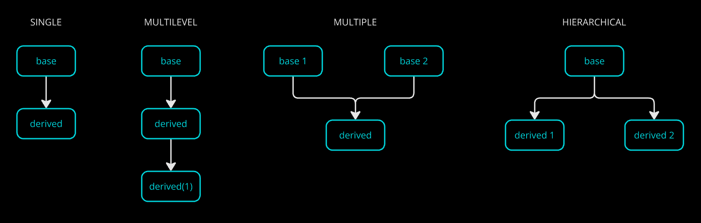

### EncApsulatiOn
Make a capsule of (combine) all info (data + methods) related to an entity.

### Polymorphism
| Implementation | Definition | Type
| --------- | -------- | --------- |
Function overloading | 1 function name overloaded with different jobs | Compile time
Operator overloading | 1 operator can perform multiple jobs | Compile time
Virtual functions | Runtime


#### Func overloading
= Same name, different args

Rules to decide function
 1. Found exact match with a declaration? Done. Else,
 2. Promote char -> unsigned char, short -> int, float -> double. Else,
 3. Std conversion of primary variables (int, char, float) among themselves. Else,
 4. Error

#### Operator overloading

`sizeof, ?:` can't be overloaded.


### Inheritance
Inherit properties (DRY) of existing (aka old / parent / base) class into a new (aka child / derived) class. Just define the new properties specific to that car.

```cpp
class Base_Class { };
class Derived_Class : visibility_mode Base_Class, ... { }; // multiple inheritance
```


**Types of users:**

1. Create objects
2. Create derived classes

#### Visibility modes
1. Private - nobody can access even though it is inherited
2. Protected - Users_2 can
3. Public - both can

All are available after object creation. Accessibility depends on the above 3.