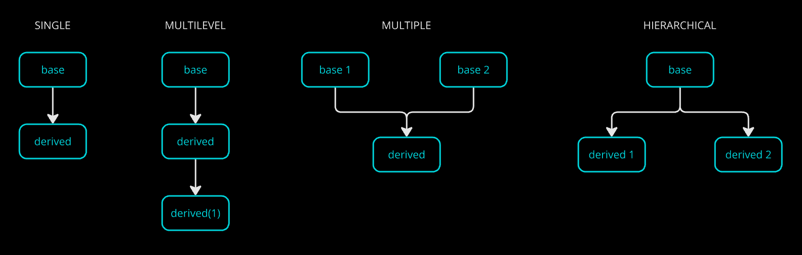
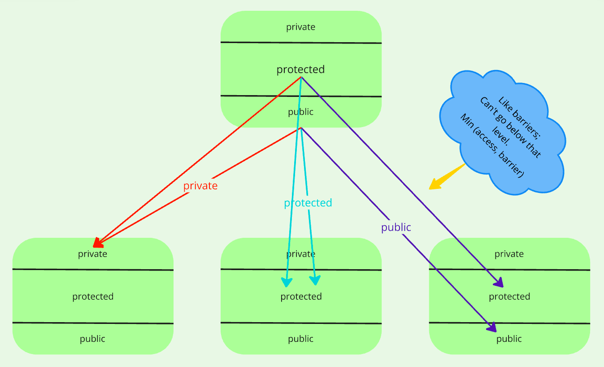

### EncApsulatiOn
Make a capsule of (combine) all info (data + methods) related to an entity.

### Polymorphism
| Implementation | Definition | Type
| --------- | -------- | --------- |
Function overloading | 1 function name overloaded with different jobs | Compile time
Operator overloading | 1 operator can perform multiple jobs | Compile time
Virtual functions | Runtime


#### Func overloading
= Same name, different args

Rules to decide function
 1. Found exact match with a declaration? Done. Else,
 2. Promote char -> unsigned char, short -> int, float -> double. Else,
 3. Std conversion of primary variables (int, char, float) among themselves. Else,
 4. Error

#### Operator overloading

`sizeof, ?:` can't be overloaded.


### Inheritance
Inherit properties (DRY) of existing (aka old / parent / base) class into a new (aka child / derived) class. Just define the new properties specific to that car.

```cpp
class Base_Class { };
class Derived_Class : access_specifier Base_Class, ... { }; // multiple inheritance
```


**Types of users:**

1. Create objects
2. Create derived classes

#### Access Specifiers
1. Private - nobody can access even though it is inherited
2. Protected - Users_2 can
3. Public - both can



All are available after object creation. Accessibility depends on the above 3.

Types of association
- Aggregation
- Composition
- Inheritance

**_Is a_ relationship is implemented as _public inheritance_. Because this is the only case where parent's public properties are accessible to derived's object.** And we want all to be accessible in is-a relation right.

So when private / protected?

Sometimes the parent defined functions might differ in aim. Maybe child object won't want to use parent's function. (In 4_inheritance). No is-a relation here.

#### Constructors
- Order of constr. call = child -> parent
- Order of constr. execution = parent -> child

Define both constructors. Compiler will call child, go to parent, execute it, return and execute child.

In case of 
1. no initialization of parent constr. in child, compiler goes  to default constr.
2. custom constr. in parent, compiler won't find default and throw error. So parameterize parent constr. in child accordingly.

While in **destructors**, call & execution: child -> parent.
Compiler works fine by default.