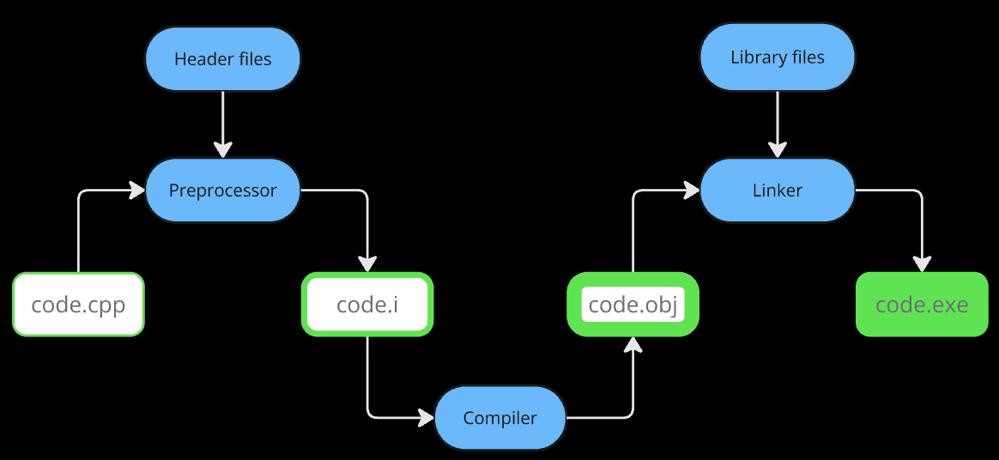

# C++

By _Bjarne Stroustrup_

Earlier: Extended version of C

Aka **C with Classes**

1. First OOPs language: Simula67
2. Java was written in C++
3. Major OSs are written in C++ (hence a very interesting and fun language)

C++ is a *superset of C*.

Follows bottom up approach: make all components and functions. Use them later. Ideal for big projects.

#### Class
- members + functions 
- non-primitive / user defined data type
- blueprint (description) of object

#### Object
- instance (eg.) of class
- members + functions (again) but actually consumes memory

### Software Development Process



A file (code.cpp) begins with `#include <filename>` statements. *Preprocessor* substitutes them with the content of the header files.

The new file (code.i) contains all the resolved #-statements + our code. It isn't stored anywhere, but processed in RAM.

*Compiler* converts it into OS-understandable language (code.obj / object file) but it still contains parts / variables, stored in library files, the OS doesn't recognize.

*Linker* links library files to the object file and generates the much awaited code.exe.

> Software is a program that manages information ( / data).

---

#### Variable 
= name of data's address

 1. Ordinary: stores data
 2. Pointers: stores address of var
 3. Reference: aka var. It has separate memory. *Internal ptr. Initialize during declaration with already existing variables. Can't update.*
  
| Variable | Space |
| ---------- | ---------- |
Char | 1 byte ( = 8 bits)
Int | 2 bytes
Float | 4 bytes
Double | 8 bytes
| - - - - - - - - - - | - - - - - - - - - - |
**Process** | **Std. Device**
i/p | Keyboard
o/p | Monitor

Header files contain declaration of identifiers (function names / variables / objects / macros). Their implementation is in library files.

To use a predefined function (or an identifier), one must include the corresponding header file in C++.

Eg.- `#include <iostream.h>` for `cout` / `cin`.

### Functions
- Enter RAM when called in main. Exit after execution.
- Better memory utilization: all program is not executed simultaneously
- Time consuming: jumping to function, saving registers, pushing args in stack, returning to calling function

#### Inline functions
1. Request to compiler (who might reject it).
In case of a few lines, better to make inline functions. They are expanded in line when invoked. 

2. But they shouldn't contain loops / recursion / switch / goto / static variables etc. They should be small in size otherwise *overhead cost* of actual function execution < switching time from caller to callee haha!

3. Return type: void.

### Struct
- Or structure is a collection of dissimilar elements
- It creates custom data types by grouping variables
- Keyword `struct` is optional
- Can make methods in them
- Since it was in C, so for backward compatibility

| | Class | Struct
| ---------- | ---------- | ---------- |
Members by Default | Private | Public
Instances | Objects | Variables
Inheritance | Yes | No

### Static
 1. local var: 
 
 - default 0, 
 - gets memory while declaration, not late (at the time of making instances)
 - lives throughout the program, not dependent on making instances
 2. member var
 - aka class member var
 - declared in class body, defined outside class
 - belongs to the class, not any of the objects => only 1 copy for the whole class, so any object can use the same copy
 - can be used with class name too
 3. member function
 - aka class member func
 - only access (2.) because they can be called without object too

#### Scope (::) Resolution

1. To access global var when there's local with same name: `::x` vs `x` (global vs local)
2. When working with class(es):
  
    - define func outside: `return_type class_name::function_name (params) { }`
    - multiple inheritance: `outside::inside::x` or maybe`outside::x, inside::x`

3. To access static variables

### Constructor
- Initializes object properties
- Compiler makes 2 by default (i.e. until no custom is made): default - non parameterized, copy
- Default won't work if custom constructors > 0
- Copy won't work after custom copy constructors
- Instance member function (can't be static)
- No return type
- Solves problem of initialization (provides default value to the object entities rather than garbage)
```cpp
class Account {
  /**
   * Error because it's actually:
   *      Account a = acc1
   *   => Account a(acc1) 
   * which makes an object and calls the constructor again. And again. And again. Recursion.
   * 
   * Soln: 
   *      Account (Account &a)
   *      Don't create the object, just pass reference
  */
  Account (Account a) { }
};

int main() {
  Account acc1, acc2(acc1);
}
```

### Destructor
- Instance member function
- Never static, no return type
- Takes no argument, so no overloading is possible
- It doesn't destroy object, it's the *last function call* for the object after which it automatically gets destroyed.
- Define it to release resources allocated to object. 

*Imagine a ptr P in class that points to a resource R. Although P is destroyed after object destruction, R still remains in the memory with no pointer (hence, not accessible now). It's important to take care of these edges cases (and more) during destruction.*

#### Friend function
- Not a member, just a friend
- Declared in class using `friend`, defined outside that class
- No caller object because function is not a member. Not directly, but it can access any member (`obj->property`)
- ++ It can access private members of classes. Imagine any other function being able to do that. Right!
- Member function of 1 class can be friend of another

```cpp
/**
 * Member function:
 * caller_operand.func_name(operands - 1 params)
 * Friend function:
 * func_name(operands params) 
*/
c2 = c1.operator-(); // c2 = -c1;
c2 = operator-(c1);
cout.operator<<(c1); // cout << c1;

friend return_type class_1::func(); // declaration in class_2 let's say
friend class class_1; // all class_2 funcs., properties are available for class_1 (it's a friend class)
```

*Friendship is not mututal or inherited.*

### This ptr

= local *object ptr* in every instance member, or non-static, function containing address of the caller object (aka refers to current instance, or caller object, of class)

Ptr contains address of the data type for which it's defined. Hence `this` points to object type.

Can't be modified.

Can be used to-
1. Declare indexers (The C/C++ indexer uses the parser to create a database of your source and header files that provides the basis for C/C++ search, navigation features and parts of content assist. The indexer runs on a background thread and reacts to resource change events such as: C/C++ project creation/deletion.)
2. Pass current object as a parameter to another func


Thanks to [Saurabh Shukla Sir](https://www.youtube.com/playlist?list=PLLYz8uHU480j37APNXBdPz7YzAi4XlQUF)