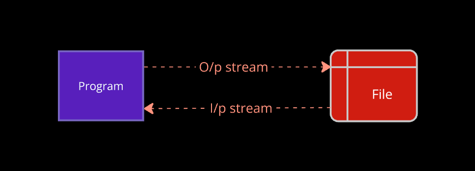
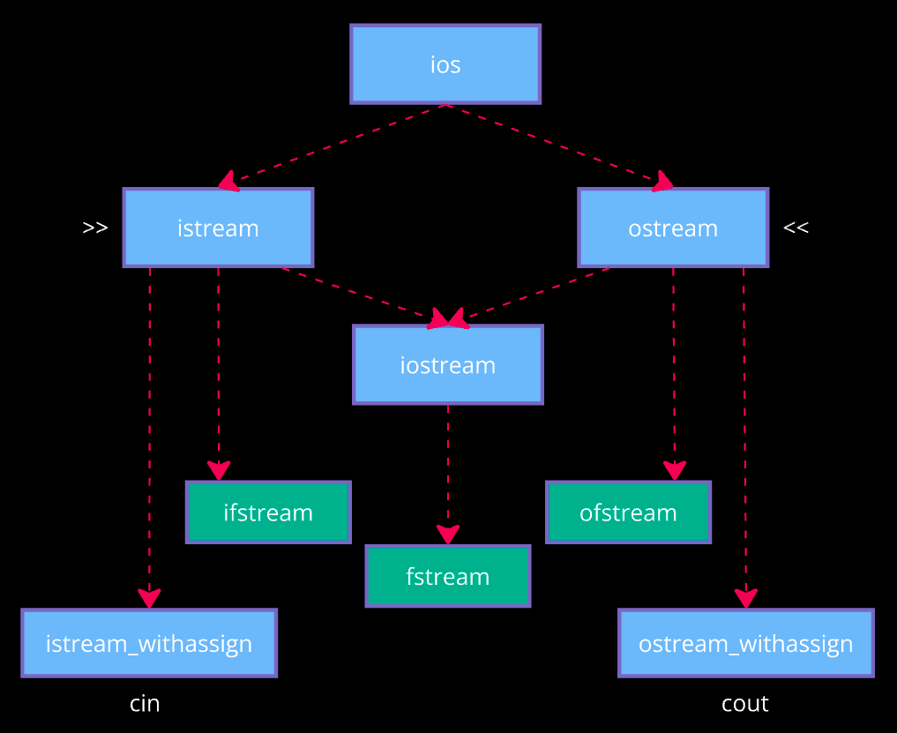

Program enters RAM, executes, exit. So var's life = program's life

What if data is to be stored permanently?
=> Store it in hard disk. In file.
Retrieve when using next time.

This is file handling; writing (o/p), reading (i/p) from file.

### Process
1. Open a file.
2. Var in file through a channel -> **stream** -> a flow of bits

Cpp has inbuilt classes that manage streams, represent file data through stream objects.

`cout`, `cin` are predefined. But we have to make objects of file classes.

For writing, `ofstream` object represents output stream. Output in the file.

### Modes

1. **`ios::in`**
    - input / read
    - default for `fin.open();`

2. **`ios::out`**
    - output / write
    - default arg. `fout.open();` opens new file.
    - del old content, write new

3. **`ios::app`**
    - append
    - add to the old content

4. **`ios::ate`**
    - update
    - modification

5. **`ios::binary`**
    - binary files contain binary representation of characters
    - open in binary mode i.e. won't consider special characters (text files do)
        - text files: convert char -> ASCII value -> binary code
        - when opened: every 8 bits are converted to ASCII and symbol is displayed
        - for binary files: if interpreted as characters, yields non-printable chars. Alternative: convert binary -> hexadecimal data.

`fout.open("file_name", mode);`

#### More functions

| | `tellg()` | `tellp()`
| -- | -- | -- |
meaning | get ptr | put ptr
indices basically | cur char to read | cur char index
in _ class | `istream` | `ostream`
prototype (return type guarantees unsigned int) | `streampos tellg();` | `streampos tellp();`
returns position of current char in | input stream | output stream
| | `get` returns file[i]; i++;

| | `seekg()` | `seekp()`
| -- | -- | -- |
in _ class | istream | ostream
| definition | seek / reset a ptr / position to read in file | put / write in file this time
prototype | `istream& seekg (streampos pos_wrt_beginning);` | `ostream& seekp (streampos pos);`
| way can be ios_base :: [beg, cur, end] | `istream& seekg (streampos offset_relative_to_way, ios_base::seekdir way);` | `ostream& seekp (streampos offset_relative_to_way, ios_base::seekdir way);`

*Always close file after working in it. This will store changes from RAM to hard disk.*

### Serialization
Storing and retrieving the state of an object

Class must have a default constructor

### Manipulators
Helping functions to modify i/o streams.

Modifies the format of streams using << and >> operators.

    - cout << "\n";
    - Integer man.: hex, oct, dec
    - Float man.: fixed, scientific
    - Other like setw (set amount of space to display data)