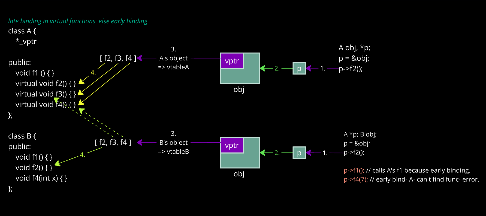

### Memory allocation

| | Static | Dynamic |
|-- | -- | -- |
Created by | Declaration statements | `new data_type`
Process | Compiler gets to know about program's vars, thus the memory required, during compile time. When program runs, it loads into the RAM where vars get the memory defined. | Memory is defined during runtime. |
| `int *p =` | `x` | `new int;`
| `float *q =` | `3.5f` | `new float[5];`
| Explanation | Ptrs are statically defined | Dynamic vars that just have static ptrs, no name. `new` returns address of the new var.
Life | Scope of var | Throughout the program unless deleted 
Destruction | After their scope | `delete` releases the dynamic memory but ptr exists. `delete p; delete []q;`
Flexible | Memory, life of vars can't change. Hence static. | Dynamic because of custom creation, destruction
Use when | memory is defined (avg. of 7 numbers) | unknown memory size, variable count etc.
Binding | Early | Late
Speed | Quick | Slower


### Method overriding
When `parent_func()` implementation is different from what `child_func()` wants for the same activity, override the function by the same name as `parent_func()` prototype. This way the parent version won't work and child can define their version.

#### Upcasting
>base_class_ptr = &derived_obj;

Yes this is possible. Upcasting any derived class ptr to base class. It lets us handle derived as if they were base types.

Like a basic car ptr pointing to an advanced car.
>car_ptr = &adv_car;

| | Early binding | Late binding
| -- | -- | --
 references | pointer declaration type | object type the pointer points to
| time | compile | run
`parent ptr = &child_obj;` | call parent functions | call latest versions of the functions (in parent / child). Decide through vtable.

   - Compiler doesn't know type of object address (it's allocated at runtime).

Functions of base class will work on the ptr. It's like owning but having no idea about that Porsche (check the garage haha).

**Problem**: child should work right? No func overriding here!

**Solution**: Stop early binding. Because address type will be unknown with it.

Use `virtual` before parent_func() declaration.
Any func with same prototype in any descendant class will be virtual now. No need to declare everytime.

Now ptr's object type is referred instead of ptr type.
=> Child functions(); ✅ 

See a virtual func? Compiler implicitly makes 
  1. *_vptr
   - Only in parent class (to show the class contains virtual func.(s))
   - Descendants automatically inherit the var
   - Identify: size of operators of object will be 2 bytes more. Because of the ptr.
   
  2. vtable []
   - A static array that stores virtual functions' pointers
   - Different for parent and each descendant class
   - vptr stores vtable's address




[Saurabh Shukla Sir on virtual function working](https://www.youtube.com/watch?v=Z_FiER8aAqM&list=PLLYz8uHU480j37APNXBdPz7YzAi4XlQUF&index=45&ab_channel=C%2B%2BbySaurabhShuklaSir)


### Template

#### 1. Function template
aka generic function

When same function, same implementation, just different types, make template.

```cpp
template <class Type, class Y...> return_type func_name(Type params...) { }
```

(`return_type` can be Type / Y /...)

Process: When function is called, while early binding, compiler checks data type of args. `Type` is set appropriately.

#### 2. Class template
aka generic class
```cpp
template <class Type> class class_name{ };
```
code in file.