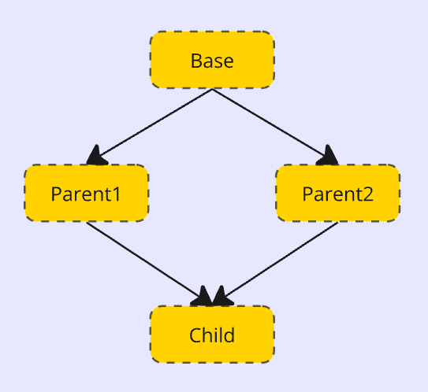
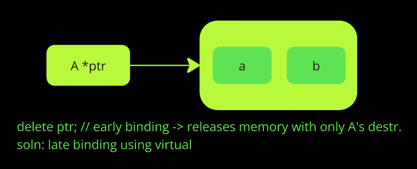

### EncApsulatiOn
Make a capsule of (combine) all info (data + methods) related to an entity.

### Polymorphism
| Implementation | Definition | Type
| --------- | -------- | --------- |
Function overloading | 1 function name overloaded with different jobs | Compile time
Operator overloading | 1 operator can perform multiple jobs | Compile time
Virtual functions | Runtime


#### Func overloading
= Same name, different args in same class

Rules to decide function
 1. Found exact match with a declaration? Done. Else,
 2. Promote char -> unsigned char, short -> int, float -> double. Else,
 3. Std conversion of primary variables (int, char, float) among themselves. Else,
 4. Error

#### Operator overloading

`sizeof, ?:` can't be overloaded.


### Inheritance
Inherit properties (DRY) of existing (aka old / parent / base) class into a new (aka child / derived) class. Just define the new properties specific to that car.

```cpp
class Base_Class { };
class Derived_Class : access_specifier Base_Class, ... { }; // multiple inheritance
```


**Types of users:**

1. Create objects
2. Create derived classes

#### Access Specifiers
1. Private - nobody can access even though it is inherited
2. Protected - Users_2 can
3. Public - both can


All are available after object creation. Accessibility depends on the above 3.

Types of association
- Aggregation
- Composition
- Inheritance

**_Is a_ relationship is implemented as _public inheritance_. Because this is the only case where parent's public properties are accessible to derived's object.** And we want all to be accessible in is-a relation right.

So when private / protected?

Sometimes the parent defined functions might differ in aim. Maybe child object won't want to use parent's function. (In 4_inheritance). No is-a relation here.

3 types of **relations** with parent:
```cpp
class Is_a : public A { };

class Has_a {
  A *obj = new A();
  // ...
};

class Uses_a {
  void disp() {
    A *obj = new A();
    // ...
  }
};
```

#### Constructors
- Order of constr. call = child -> parent
- Order of constr. execution = parent -> child

Define both constructors. Compiler will call child, go to parent, execute it, return and execute child.

In case of 
1. no initialization of parent constr. in child, compiler goes  to default constr.
2. custom constr. in parent, compiler won't find default and throw error. So parameterize parent constr. in child accordingly.

While in **destructors**, call & execution: child -> parent.
Compiler works fine by default.


#### Pure virtual function
= do nothing function = no body

```cpp
class A {
   public:
      virtual void pure_virt() = 0;
      void might_be_used() { }
};

class B : public A {
   public:
      void pure_virt() { }
};

👎 A obj; 
👍 A *der_ptr;
```

- Can't make object of A. Inheritance will help here. B's object calls A's functions.
- Mandatorily override it ( with `virtual` ). Late binding allows overriding functions to run. Always.
- - But if child (B) is abstract, add 1 more level of inheritance. Because A & B can't be used then.

=> No way to call pure func now.

If a class contains pure virtual func, it's an **abstract class**. In Java, `abstract` is used.

*Why abstract class?*

Generalization helps in better maintainability, coding practices. Make parent class to include common features of all children. But sometimes, that's just it.

That's the only purpose of the class: to store common data. An entity would only be defined if it's combined with more specific info. (child classes). We know parent object won't be an entity.

Student, Faculty: gender, age, personal email... are common fields. Make them into 1 Person class.

But roll number, subject_grades... - student specific.
While teaches_subject, experience... teacher specific.
Person won't be needed as entity. Hence, make it abstract.


#### Diamond Problem (multiple-path inheritance)



Child can access Base's properties (members + functions) through multiple paths causing confusion during access + resolution.

<span style="color: lightgreen;">Soln: virtual inheritance - ensures only 1 instance of Base is inherited</span>

```cpp
class Base {...};
class Parent1 : virtual public Base {...};
class Parent2 : virtual public Base {...};
class Child : public Parent1, public Parent2 {...};
```

<span style="color: orange;">Ensure proper init of virtual base classes to avoid runtime errors.</span>

#### Destructor

